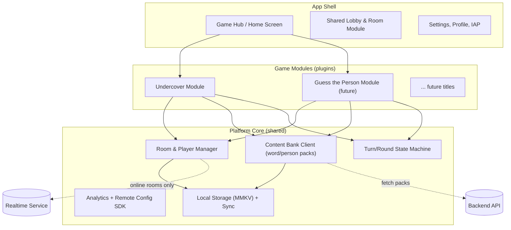
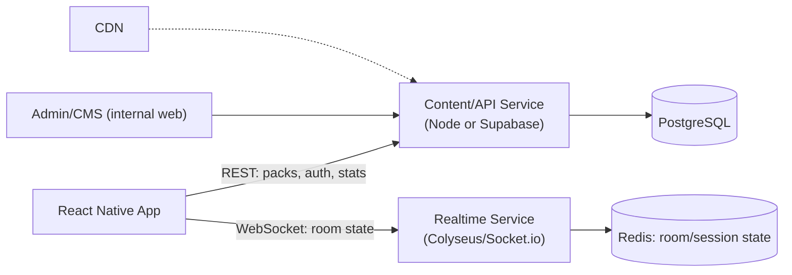
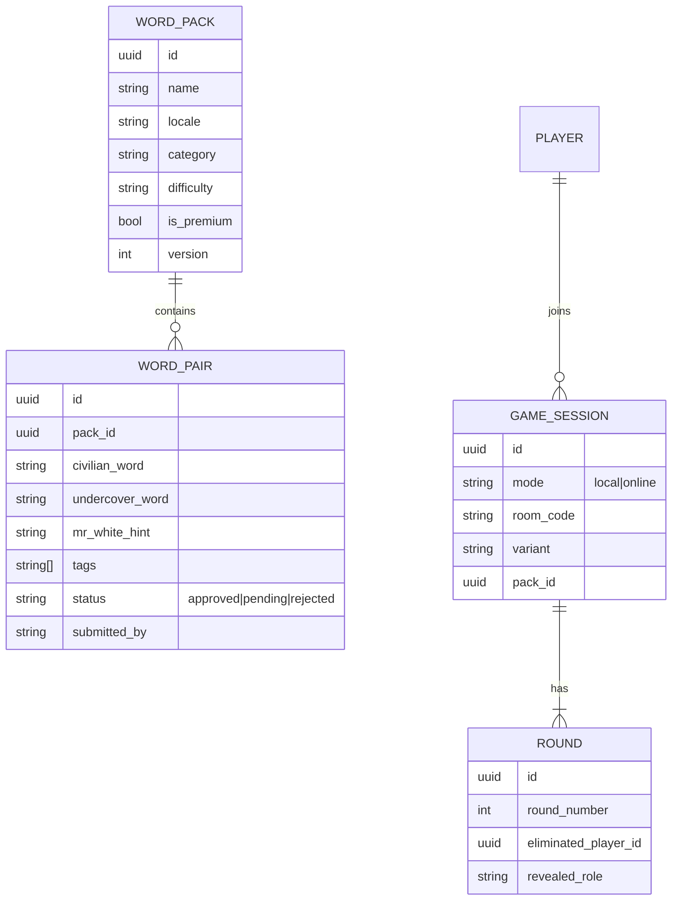
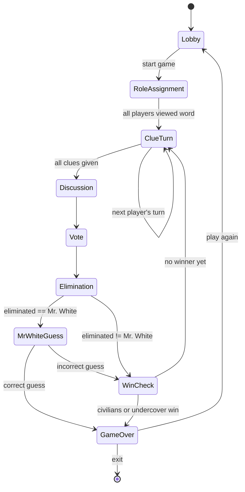

# Undercover — Architecture & Game Design Document

Status: Draft v1 · Owner: Sanjay Sharma · Date: 2026-07-17

## Table of Contents
1. [Product Vision](#1-product-vision)
2. [Game Design](#2-game-design)
3. [Platform Architecture (Multi-Game Hub)](#3-platform-architecture-multi-game-hub)
4. [Client Architecture (React Native)](#4-client-architecture-react-native)
5. [Do We Need a Backend?](#5-do-we-need-a-backend)
6. [Word Bank / Content System](#6-word-bank--content-system)
7. [Backend Architecture](#7-backend-architecture)
8. [Data Model](#8-data-model)
9. [Round Flow (State Machine)](#9-round-flow-state-machine)
10. [Roadmap](#10-roadmap)
11. [Risks & Open Questions](#11-risks--open-questions)

---

## 1. Product Vision

**Undercover** is a social deduction party game. Most players receive the same secret word (the *Civilians*), one or more players receive a related-but-different word (the *Undercover*), and sometimes a player receives no word at all (*Mr. White*). Through rounds of clue-giving and voting, players try to unmask the odd one out while the odd one out tries to blend in.

The app is being designed as a **party-game platform**, not a single-purpose app — "Undercover" is the first title, but the architecture should let us bolt on future titles (e.g. "Guess the Person") without a rewrite.

Two problems this doc explicitly solves:
- The existing implementation's word list is small and repeats quickly — words feel stale after a few sessions. See [§6](#6-word-bank--content-system).
- There's no growth path from "offline pass-and-play" to "online with friends" — see [§5](#5-do-we-need-a-backend) and [§10](#10-roadmap).

---

## 2. Game Design

### 2.1 Core Loop (Classic Variant)

1. **Setup** — 3–20 players. Choose a word pair (e.g. *Coffee* / *Tea*) and role distribution.
2. **Role assignment** — Each player privately views their word on-device (pass-and-play) or on their own phone (online). Roles: `Civilian`, `Undercover`, `Mr. White` (no word).
3. **Clue phase** — Turn order is randomized once per game. Each player, in turn, says one word/short phrase describing their secret word without saying the word itself.
4. **Discussion** (optional timer) — Open floor to debate who sounds suspicious.
5. **Vote phase** — All players vote simultaneously for who to eliminate. Majority (or plurality) is eliminated and their role is revealed.
6. **Mr. White twist** — If Mr. White is eliminated, they get one chance to guess the Civilian word; a correct guess wins the game for them outright.
7. **Win check** — repeat from step 3 until:
   - All Undercover + Mr. White are eliminated → **Civilians win**.
   - Undercover players count ≥ remaining Civilians → **Undercover wins**.
8. **Reveal & rematch** — show full role list, offer "play again" (reshuffles words/roles, same player list).

### 2.2 Variants (config, not new games)

All variants below are just different parameterizations of the same round engine — no new screens needed, just rule-flags:

| Variant | Change from Classic |
|---|---|
| **Classic** | 1 Undercover, rest Civilians |
| **Mr. White** | Add 1 player with a blank word and steal-win-by-guessing rule |
| **Multi-Undercover** | Undercover count scales with players (e.g. `floor(players/4)`) |
| **Duo/Team mode** | Undercover players know who their teammate is |
| **Speed round** | Hard per-turn clue timer (e.g. 15s), no open discussion phase |
| **Silent clues** | Clues are written/typed instead of spoken — good for online mode |
| **No-elimination round** | Occasional round has discussion + vote but no elimination (bluff-only), raises tension |
| **Theme packs** | Word pairs pulled from a themed pack (Movies, Food, Bollywood, Brands, Kids-safe, custom user pack) instead of the default mixed pack |
| **Custom words** | Host manually enters both words for a fully private game |

Because variants are just configuration on top of one engine, product can ship new variants via remote config (§6) without an app release.

### 2.3 Future Title: "Guess the Person"

Players think of a person (celebrity, or a name assigned by the app); one player is "it" and asks yes/no questions to guess who everyone is thinking of, or (alternate mode) everyone has the same secret person visible to all *but* themselves (Heads-Up/Hedbanz style) and asks yes/no questions to guess their own identity.

Notice it reuses the same building blocks as Undercover:
- Room/lobby + player list
- Secret-assignment engine (assign a *word* vs assign a *person*)
- Turn engine (ask/answer instead of clue/vote)
- Content bank (people packs instead of word packs)
- Reveal screen

This is why §3 proposes a shared **platform core** with per-game **modules**, rather than N separate apps.

---

## 3. Platform Architecture (Multi-Game Hub)



**Contract each game module implements** (a simple TS interface, not a framework):

```ts
interface GameModule {
  id: string;                 // 'undercover', 'guess-the-person'
  minPlayers: number;
  maxPlayers: number;
  variants: VariantConfig[];
  assignRoles(players, variant): RoleAssignment[];
  RoundScreen: React.ComponentType<RoundProps>;
  VoteScreen?: React.ComponentType<VoteProps>;
  ResultScreen: React.ComponentType<ResultProps>;
}
```

New titles register a `GameModule` and appear on the Home hub automatically — no changes to `RoomEngine`, `ContentEngine`, or navigation shell required.

---

## 4. Client Architecture (React Native)

Stack recommendation (fits the RN 0.86 / React 19 / TS setup already in this repo):

| Concern | Choice | Why |
|---|---|---|
| Navigation | React Navigation | De facto standard, deep-link support for room codes |
| State | Zustand | Minimal boilerplate for game/turn state machines vs Redux |
| Local persistence | `react-native-mmkv` | Fast sync storage for cached word packs, settings, last-played |
| Animations | Reanimated + Gesture Handler | Card flip/reveal, timer rings |
| i18n | `react-i18next` | Needed anyway once word packs are localized (§6) |
| Networking | `@tanstack/react-query` over `fetch` | Caching/retry for word-pack + (later) API calls, works offline-first |
| Realtime (online mode, later) | `socket.io-client` | Paired with backend choice in §7 |

### Proposed folder structure

```
src/
  app/                     # navigation container, root providers
  core/
    room/                  # RoomEngine: player list, roles, session lifecycle
    content/                # ContentEngine: pack fetch/cache/anti-repeat deck
    turn/                   # TurnEngine: generic round state machine
    analytics/
    storage/
  games/
    undercover/
      config.ts             # variants, min/max players
      screens/               # RoleReveal, ClueTurn, Vote, Result
      logic/                 # role assignment, win-condition checks
    guess-the-person/        # future, same shape
  packs/                     # bundled offline word packs (seed data, JSON)
  shared/
    components/              # buttons, timers, avatars
    theme/
  i18n/
```

This mirrors the module boundary from §3 directly in the filesystem, so a future engineer adding a game copies the `games/<name>/` shape and wires one entry into the hub registry.

---

## 5. Do We Need a Backend?

**Short answer: not for the core offline loop, yes for everything that makes the product durable and growable.**

The single-device "pass-and-play" mode (majority of party games like this are played this way — one phone passed around the table) needs **zero backend**: role assignment, clue turns, and voting all happen locally. Shipping the MVP backend-free is legitimate and fast.

However, three things you already care about *require* a backend eventually:

1. **Fixing word redundancy without app-store releases** — the fastest fix for "the word list is small and repeats" is a **content-delivery backend**: word packs live server-side, versioned, and the app pulls updates on launch (cached, offline-tolerant). Without this, every new word requires an app binary release.
2. **Online multiplayer** (each player on their own phone, not passing one device) — requires a room/session server with realtime state sync.
3. **Growth mechanics** — accounts, stats, leaderboards, community-submitted word packs, moderation — all inherently server-side.

**Recommendation:** build backend-free for MVP local play, but stand up a *lightweight content API* immediately after (Phase 1 in the roadmap) specifically to solve the redundancy complaint — this is the highest-leverage, lowest-effort backend investment. Defer realtime multiplayer and accounts to later phases.

---

## 6. Word Bank / Content System

This section directly addresses the "limited data set / redundant words" concern.

### 6.1 Why words feel redundant today

Typically this comes from two independent bugs, not just "not enough words":
- **Small absolute pool** (a few dozen pairs hardcoded in the client).
- **Naive randomness** — `pairs[Math.floor(Math.random() * pairs.length)]` can repeat the same pair in back-to-back games, or even skip large parts of the list for many sessions (birthday-paradox clustering). This *feels* worse than the pool size alone would suggest.

### 6.2 Fix #1 — Proper no-repeat shuffling ("deck" model)

Treat each word pack like a physical card deck, not a random draw:
- Shuffle all pairs once per app-session (Fisher–Yates).
- Draw sequentially without replacement.
- When the deck is exhausted, reshuffle — but exclude the **last N drawn** (e.g. last 20% of pack size) from the new shuffle's front, so the same pair can't reappear immediately after a reshuffle either.
- Persist the deck cursor + recent-history in MMKV so it survives app restarts, not just in-memory.

This alone removes most of the "feels repetitive" complaints even before adding new content.

### 6.3 Fix #2 — Scale the dataset, without shipping app updates for content

- Move word packs to a **remote content API** (§7): `GET /packs?locale=en&since=<version>`.
- Client caches packs locally (MMKV) with an ETag/version check on launch; fully playable offline using last-cached data.
- Bundle a seed pack in the binary (`src/packs/`) so day-1 users never wait on network.
- This turns "add more words" into a content-team/CMS task, not an engineering release — directly solving the growth bottleneck.

### 6.4 Fix #3 — Structure content for variety, not just volume

Word pack schema (see §8 for full model):
- `category` (Food, Movies, Sports, Bollywood, Tech, Kids-safe, …) — lets you mix packs so a single session pulls from several categories, multiplying perceived variety even with the same total word count.
- `difficulty` (easy/medium/hard) — easy pairs are obviously different (Cat/Dog), hard pairs are subtly different (Coffee/Tea) — supports skill progression and replayability.
- `locale` — enables localized packs (Hindi, English, Hinglish) which also multiplies effective pool size for a bilingual audience.
- `tags` — free-form, used for filters ("spicy", "kids", "adult", "desi") and future community packs.

### 6.5 Fix #4 — Community & long-tail growth (later phase)

- Let players submit custom word pairs from the app.
- Submissions land in a `pending` moderation queue (simple admin review screen or even a spreadsheet-backed queue for MVP moderation).
- Approved packs get published with attribution ("Community Pack: Bollywood by @user"). This is the cheapest way to scale content volume without a content team, once moderation tooling exists.

---

## 7. Backend Architecture

Recommended phased stack — deliberately choosing "boring, fast to ship" over "maximally scalable from day one":

| Phase | Need | Recommendation |
|---|---|---|
| Content API only | Serve/version word packs, basic admin CRUD | **Supabase** (Postgres + auto REST + Auth) or a small **Node/Express + Postgres** service if you prefer full control. Either is a few days of work. |
| Realtime rooms | Online multiplayer, room codes, presence, synced turn state | **Colyseus** (purpose-built game-room framework, Node/TS) or Socket.io on top of the same Node service. Colyseus is worth the learning curve if online play is a real near-term goal — it gives you room lifecycle, state sync, and reconnection for free. |
| Accounts & social | Login, stats, friends, leaderboards | Supabase Auth (or Firebase Auth) + same Postgres schema, extended. |
| Scale-out | High concurrency, multi-region | Move content API behind a CDN (Cloudflare) for pack delivery; horizontally scale the realtime service behind a load balancer with sticky sessions per room. |



Why not build the full custom Node/Postgres stack from day one: for a solo/small team, Supabase collapses auth + DB + REST + realtime into one hosted service, letting you validate the content-API fix (§6.3) in days rather than weeks. You can migrate off it later (it's just Postgres underneath) if you outgrow it — this is a reversible choice, not lock-in.

---

## 8. Data Model



Note: `PLAYER`/`GAME_SESSION`/`ROUND` only need to exist server-side once online mode (Phase 3) ships. For local pass-and-play, these are just in-memory/MMKV client state — don't build the server tables until you need them.

---

## 9. Round Flow (State Machine)



This state machine is the `TurnEngine` referenced in §3/§4 — it's generic enough that "Guess the Person" swaps `ClueTurn`/`Vote` for `AskQuestion`/`GuessAttempt` without changing the surrounding shell.

---

## 10. Roadmap

| Phase | Scope | Backend? |
|---|---|---|
| **0 — MVP** | Local pass-and-play, Classic + Mr. White + Multi-Undercover variants, bundled seed word packs, proper no-repeat deck shuffling (§6.2) | None |
| **1 — Content Fix** | Word-pack content API + versioned pack delivery, category/difficulty/locale metadata, admin CRUD for adding packs | Lightweight (Supabase or small Node service) |
| **2 — Online Play** | Room codes, each player on own device, realtime turn/vote sync, reconnection handling | Realtime service (Colyseus/Socket.io) added |
| **3 — Accounts & Growth** | Guest + social login, stats/history, friends, community word-pack submission + moderation queue | Auth added to existing backend |
| **4 — Platform Expansion** | "Guess the Person" as second `GameModule`, shared hub/home screen, cross-game stats | Same backend, new content tables |
| **5 — Scale & Monetize** | Leaderboards, remote config/A-B testing, ads/IAP for premium packs, CDN for content delivery, multi-region if needed | Full stack hardening |

Suggested sequencing rationale: Phase 1 ships before Phase 2 deliberately — it's the direct fix for the complaint that motivated this doc, it's far cheaper than realtime multiplayer, and it validates the content pipeline you'll reuse for every future pack (including person-packs for Phase 4).

---

## 11. Risks & Open Questions

- **Moderation liability**: community word submissions (Phase 3) need a moderation queue before going live publicly — open user-generated text is a support/abuse surface.
- **Online mode complexity**: reconnection handling (a player's app backgrounds mid-round) is the single hardest part of Phase 2 — budget real time for it, not an afterthought.
- **Supabase vs custom backend**: fine to start on Supabase; revisit only if you hit real scaling/cost limits or need logic Supabase's RLS model makes awkward.
- **Localization scope**: decide early whether Hindi/Hinglish packs are a Phase 1 or Phase 4 concern — it affects the `WORD_PAIR` schema (locale field) from day one even if you don't populate it yet.
- **Monetization model**: not yet decided (ads vs premium packs vs one-time purchase) — affects whether `is_premium` gating logic is needed in Phase 1 or can wait.
