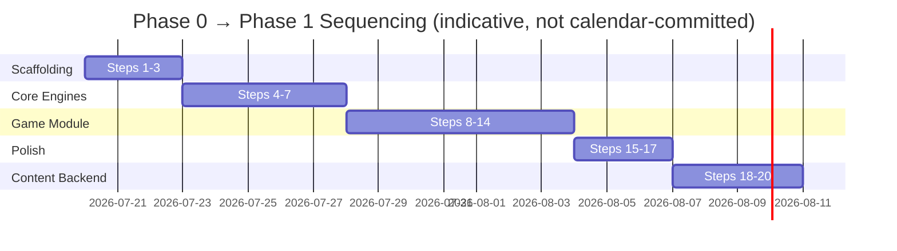

# Undercover — Step-by-Step Implementation Plan

Status: Draft v1 · Companion to [ARCHITECTURE.md](./ARCHITECTURE.md) · Date: 2026-07-17

Scope: this plan builds **Phase 0 (MVP local pass-and-play)** end to end, then closes with a lighter-detail kickoff for **Phase 1 (content backend)**. Each step lists what to build, which files it touches, and a definition of done so it can be picked up as an actual ticket.

Build order matters: engines before screens, screens before polish. Don't jump ahead — each milestone assumes the previous one is done and tested.

---

## Milestone A — Project Scaffolding

### Step 1: Install core dependencies
- Add: `@react-navigation/native`, `@react-navigation/native-stack`, `react-native-screens`, `react-native-mmkv`, `zustand`, `react-native-reanimated`, `react-native-gesture-handler`, `react-i18next` + `i18next`.
- Wire Reanimated babel plugin in `babel.config.js`, rebuild pods for iOS.
- **DoD**: app still boots on iOS + Android with no new dependency errors.

### Step 2: Create folder skeleton
- Create the structure from `ARCHITECTURE.md` §4 under `src/`: `app/`, `core/{room,content,turn,storage}/`, `games/undercover/{config,screens,logic}/`, `packs/`, `shared/{components,theme}/`, `i18n/`.
- Move `App.tsx` logic into `src/app/App.tsx`, keep root `App.tsx` as a thin re-export.
- **DoD**: empty folders committed with `index.ts` barrel files where useful; app still runs.

### Step 3: Navigation shell + theme
- Build `src/app/Navigation.tsx` with a native-stack navigator: `Home`, then a per-game nested stack registered dynamically (start with just `Undercover`).
- Build `src/shared/theme/` (colors, spacing, typography) — keep minimal, dark/light aware via `useColorScheme`.
- **DoD**: navigating Home → a placeholder Undercover screen → back works on both platforms.

---

## Milestone B — Core Engines (local-only, no network)

### Step 4: Shared types
- `src/core/types.ts`: `Player`, `WordPair`, `WordPack`, `Variant`, `RoleAssignment`, `RoundState`.
- **DoD**: types compile and are imported by nothing yet (used starting Step 5).

### Step 5: ContentEngine — seed pack + no-repeat deck
- Create `src/packs/seed-en.json`: ~150–200 word pairs across 4–5 categories (Food, Movies/Bollywood, Sports, Objects, Animals) with `difficulty` tags — this alone is the first concrete fix for the redundancy complaint.
- Implement `src/core/content/deck.ts`: Fisher–Yates shuffle, sequential draw without replacement, reshuffle-on-exhaustion that excludes the last N drawn (per §6.2 of the architecture doc).
- Implement `src/core/content/ContentEngine.ts`: loads a pack, exposes `drawPair(): WordPair`, persists deck cursor + recent-history to MMKV (`src/core/storage/mmkv.ts`) so it survives app restarts.
- **Unit tests**: shuffle produces no immediate repeats across a full exhaustion + reshuffle cycle; cursor persists across a simulated restart.
- **DoD**: tests pass; `ContentEngine.drawPair()` never returns the same pair twice in a row even across reshuffles.

### Step 6: RoomEngine — local player roster
- `src/core/room/RoomEngine.ts` (Zustand store): add/remove/reorder players (name + avatar/color only, no accounts), min/max validation delegated to the active `GameModule`.
- Screens are built in Milestone C; this step is store + logic only.
- **DoD**: unit tests for add/remove/reorder and min/max validation edge cases (e.g. removing below `minPlayers`).

### Step 7: TurnEngine — generic round state machine
- `src/core/turn/TurnEngine.ts`: implement the state machine from `ARCHITECTURE.md` §9 (`Lobby → RoleAssignment → ClueTurn → Discussion → Vote → Elimination → MrWhiteGuess? → WinCheck → GameOver`) as a plain state-machine (hand-rolled switch or a tiny library like `xstate` if the team prefers) — generic over "what a turn/vote means" so it isn't Undercover-specific.
- **DoD**: unit tests drive the machine through a full game (win-by-civilians, win-by-undercover, win-by-Mr.White-guess) and assert correct terminal states.

---

## Milestone C — Undercover Game Module

### Step 8: Game config + role assignment logic
- `src/games/undercover/config.ts`: `minPlayers: 3`, `maxPlayers: 20`, variant list (`classic`, `mrWhite`, `multiUndercover`) with per-variant parameters (undercover count formula, Mr. White on/off).
- `src/games/undercover/logic/assignRoles.ts`: given players + variant, return shuffled `RoleAssignment[]` (civilian word, undercover word, blank for Mr. White).
- `src/games/undercover/logic/winCondition.ts`: pure function `checkWinner(remainingRoles): 'civilians' | 'undercover' | null`.
- **DoD**: unit tests cover role counts for 3–20 players across all three variants, and win-condition edge cases (last undercover eliminated, undercover reaches parity, etc).

### Step 9: Screen — Player Setup / Lobby
- `src/games/undercover/screens/Lobby.tsx`: add players, pick variant, "Start Game" (disabled until `minPlayers` met).
- Wires to `RoomEngine` (Step 6) and `config.ts` (Step 8).
- **DoD**: can add 3+ named players, pick a variant, and press Start without crashing (Start just navigates for now — role assignment wired in Step 10).

### Step 10: Screen — Role Reveal (pass-and-play)
- `src/games/undercover/screens/RoleReveal.tsx`: one card per player, "hand to [Name], tap to reveal, tap again to hide before passing" flow using Reanimated for the flip.
- Pulls the word from `ContentEngine.drawPair()` (Step 5) once per game start, and roles from `assignRoles()` (Step 8).
- **DoD**: manual playtest with 4+ players passing one device confirms no word is visible to the wrong player (add a confirmation step before reveal: "Are you sure you're `[Name]`?").

### Step 11: Screen — Clue Turn
- `src/games/undercover/screens/ClueTurn.tsx`: shows whose turn it is in turn order (spoken clues — app just tracks turn order and advances on tap, doesn't need text input for MVP).
- Advances the `TurnEngine` (Step 7) to `Discussion` once all players have had a turn.
- **DoD**: turn order cycles correctly, skips already-eliminated players in later rounds.

### Step 12: Screen — Vote & Elimination
- `src/games/undercover/screens/Vote.tsx`: tap-to-vote per player (all votes cast on the single shared device before revealing), tally, reveal eliminated player + their role.
- Branches to `MrWhiteGuess` screen if applicable, else straight to `WinCheck`.
- **DoD**: tie-vote handling defined (e.g. revote among tied players) and tested manually.

### Step 13: Screen — Mr. White Guess + Game Over
- `src/games/undercover/screens/MrWhiteGuess.tsx`: text input, single guess, compares (case/whitespace-insensitive) to the civilian word.
- `src/games/undercover/screens/GameOver.tsx`: full role reveal list, winner banner, "Play Again" (re-draws a fresh pair + reshuffles roles, same players) and "New Game" (back to Lobby).
- **DoD**: full game playable start-to-finish with no dead ends, "Play Again" never repeats the immediately-previous word pair (verifies Step 5's deck logic end-to-end).

### Step 14: Home Hub screen
- `src/app/screens/Home.tsx`: simple game registry (`GameModule[]` array with just `undercover` for now), tapping a tile navigates into that module's Lobby.
- **DoD**: structured so adding a second entry to the registry array is the only change needed to list a future game (validates the §3 module contract without yet building a second game).

---

## Milestone D — Polish & Quality Gate

### Step 15: Visual polish pass
- Card flip animation, turn indicator, timer ring (optional per-variant), consistent theme usage from Step 3.
- **DoD**: no unstyled/default RN placeholder screens remain.

### Step 16: i18n scaffolding
- Wrap all user-facing strings in `react-i18next`, `src/i18n/en.json` as the only locale for now.
- **DoD**: no hardcoded strings in `games/undercover/screens/*`; adding a second locale file later requires no code changes.

### Step 17: Test pass + manual QA checklist
- Run full unit suite (Steps 5, 6, 7, 8).
- Manual QA checklist: 3-player game, 20-player game, each variant, Mr. White correct/incorrect guess, tie vote, app-kill-and-reopen mid-game (confirms MMKV persistence doesn't break restart).
- **DoD**: checklist signed off, `npm test` green, `npm run lint` clean.

**→ Phase 0 MVP ships here.** Everything below is Phase 1 kickoff — don't start it until Phase 0 is playtested.

---

## Milestone E — Phase 1 Kickoff (Content Backend)

### Step 18: Stand up Supabase project
- Create `word_pack` and `word_pair` tables per the ERD in `ARCHITECTURE.md` §8.
- Seed with the same `seed-en.json` content from Step 5 plus 2–3x more pairs across the existing categories — this is the real volume fix.
- **DoD**: tables queryable via Supabase's auto-REST with `locale`/`category`/`difficulty` filters.

### Step 19: Remote pack fetch + cache in ContentEngine
- Extend `ContentEngine` (Step 5) with `fetchRemotePacks()` using `@tanstack/react-query`: fetch on app launch, cache via MMKV, fall back to bundled seed pack if offline or first-launch-before-first-fetch.
- Version/ETag check so repeat launches don't re-download unchanged packs.
- **DoD**: airplane-mode launch still plays using cached/bundled data; online launch picks up newly-added Supabase rows without an app update.

### Step 20: Minimal content add flow
- No custom admin UI yet — use Supabase's built-in table editor as the interim "CMS" for adding word pairs.
- Document the add-a-pair process in `docs/CONTENT_GUIDE.md` (pack naming convention, difficulty rubric, tagging) so non-engineers can contribute safely.
- **DoD**: a non-engineer can follow the doc to add a new pair and see it appear in-app after next launch.

---

## Suggested Sequencing Summary

Treat the day counts as relative sizing, not a committed calendar — adjust to actual team velocity once Steps 1–3 are done and you have a real cycle-time data point.
